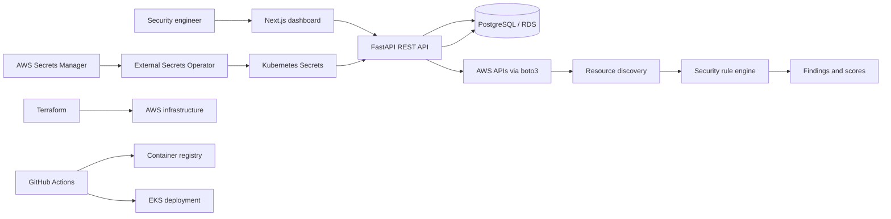

# CloudGuard CSPM

CloudGuard CSPM is a cloud security posture management portfolio project for discovering AWS resources, evaluating configuration controls, presenting findings, and organizing remediation work. It combines a Next.js dashboard, a FastAPI service, PostgreSQL persistence, AWS discovery through boto3, infrastructure-as-code, and Kubernetes deployment manifests.

> **Implementation status:** The repository contains the application code, infrastructure definitions, CI/CD configuration, and Kubernetes manifests. A production deployment is **not claimed or verified by this README**. Replace example values, configure external systems, and validate the deployment in your own AWS account before using it operationally.

## 1. Project overview

CloudGuard provides a central view of AWS security posture across supported services. It models accounts, resources, rules, findings, remediation records, and security scores so an operator can move from discovery to prioritized remediation.

The repository includes both:

- An implemented FastAPI backend with authentication, AWS account/resource discovery, security-rule evaluation, findings, and PostgreSQL models.
- An implemented Next.js frontend/dashboard surface with typed API helpers and mock dashboard data used by the UI where applicable.
- Terraform, Docker, Kubernetes, and GitHub Actions configuration intended to support a production-style delivery workflow.

## 2. Problem statement

AWS security issues are often distributed across accounts, regions, services, and configuration consoles. CloudGuard addresses the operational gap between raw cloud configuration and actionable security work by:

1. Discovering supported AWS resources.
2. Evaluating them against explicit security rules.
3. Recording findings with severity, service, resource, and recommendation data.
4. Presenting posture and score information in a dashboard.
5. Providing a foundation for tracked remediation.

## 3. Main features

Implemented in the repository:

- AWS account registration and authentication endpoints.
- AWS resource discovery for IAM, S3, EC2, VPC, RDS, and KMS.
- Rule-based security evaluation.
- Findings with severity, status, service, region, resource, and recommendation fields.
- Security rules persisted in the database and seeded for demo use.
- Dashboard-oriented frontend routes and typed API client code.
- Docker Compose local environment.
- Terraform definitions for AWS networking, EKS, RDS, IAM, and monitoring resources.
- Kubernetes base manifests and a production overlay.
- GitHub Actions CI and deployment workflows.
- Security hardening manifests including service accounts, network policy, pod disruption budget, security-context patches, and external secrets wiring.

Not claimed as implemented unless separately configured:

- Continuous production scanning.
- Automatic remediation against live AWS resources.
- Multi-account AWS Organizations orchestration.
- SSO, MFA enforcement, or enterprise identity integration.
- A verified production deployment.

## 4. Architecture



The intended runtime path is frontend → FastAPI → PostgreSQL and AWS APIs. Terraform provisions the AWS foundation, while GitHub Actions builds and deploys containers to Kubernetes/EKS. Runtime secrets are intended to flow from AWS Secrets Manager through External Secrets Operator rather than being committed to Git.

## 5. Technology stack

- **Frontend:** Next.js 16, React 19, TypeScript, Tailwind CSS, Lucide icons.
- **Backend:** Python, FastAPI, SQLAlchemy, Alembic, Pydantic, boto3, JWT/password authentication helpers.
- **Database:** PostgreSQL; local development can use Docker Compose, and Terraform defines an AWS RDS PostgreSQL instance.
- **Infrastructure:** Terraform, Amazon VPC/EKS/RDS/IAM/CloudWatch.
- **Runtime:** Docker and Kubernetes.
- **Delivery:** GitHub Actions, container registry, GitHub OIDC.
- **Security tooling:** SonarQube and Trivy are represented in the CI/security workflow configuration; configure their credentials and services before relying on the checks.

## 6. AWS services

The application discovers and evaluates:

- IAM users and permissions-related metadata.
- S3 bucket configuration.
- EC2 instances and security-group rules.
- VPC-related resources.
- RDS database instances.
- KMS keys and rotation metadata.

The platform infrastructure also uses or is designed for Amazon VPC, EKS, RDS PostgreSQL, ECR/container images, IAM, Secrets Manager, CloudWatch Logs, and related networking resources.

## 7. Security engine

`backend/app/security/engine.py` contains the rule catalog and evaluation logic. The engine receives normalized resource metadata, identifies the resource type, and emits rule matches with evidence. The discovery layer in `backend/app/aws/discovery.py` converts AWS SDK responses into a consistent resource representation before evaluation.

The engine is intentionally deterministic and rule-based. It does not claim to replace AWS Security Hub, GuardDuty, Config, or a full compliance platform.

## 8. Security rules

The implemented rule set includes controls such as:

| Rule | Service | Description | Severity |
|---|---|---|---|
| `RULE-IAM-001` | IAM | IAM user without MFA | High |
| `RULE-IAM-002` | IAM | Excessive IAM permissions | Medium |
| `RULE-S3-001` | S3 | Bucket publicly accessible | Critical |
| `RULE-S3-002` | S3 | Bucket without encryption | High |
| `RULE-EC2-001` | EC2 | SSH exposed to `0.0.0.0/0` | Critical |
| `RULE-EC2-002` | EC2 | Dangerous port exposed to the internet | High |
| `RULE-RDS-001` | RDS | Instance publicly accessible | Critical |
| `RULE-RDS-002` | RDS | Storage encryption disabled | High |
| `RULE-KMS-001` | KMS | Key rotation disabled | Medium |

The seed data and frontend mock catalog may contain additional presentation-oriented rules. The backend rule engine is the source of truth for live evaluation.

## 9. Security findings

A finding records a detected control failure and includes a title, description, severity, status, AWS service, resource identifier, resource type, region, recommendation, and account relationship. Findings are intended to support filtering, prioritization, and remediation tracking.

Finding status values and remediation workflow states are modeled separately where appropriate. Demo seed data is clearly synthetic and must not be interpreted as live AWS findings.

## 10. Security score calculation

The dashboard presents a posture score derived from evaluated controls and finding severity. The repository supports the data needed for score calculation, including rule outcomes and severity. The exact weighting should be treated as an application policy and validated against the current frontend/backend implementation before using the score for compliance reporting.

A typical score model is:

```text
score = passed weighted checks / total weighted checks * 100
```

Critical and high findings should receive greater weight than low findings. Any organization adopting the score should document the weighting, scope, scan timestamp, and treatment of unavailable AWS APIs.

## 11. Remediation workflow

The intended workflow is:

1. Register or select an AWS account.
2. Discover resources in the configured region/account scope.
3. Normalize resource metadata.
4. Evaluate enabled rules.
5. Store findings and calculate posture.
6. Review findings by severity and service.
7. Approve and track remediation work.
8. Re-scan and verify that the finding is resolved.

The repository provides the foundation for this workflow. Automated mutation of AWS resources is optional and is not claimed as implemented.

## 12. Frontend architecture

The Next.js App Router provides dashboard routes under `app/`, including the root page and catch-all route used by the application surface. UI components are organized under the project component directories, while `frontend/lib/api/dashboard.ts` provides typed dashboard API access. `lib/mock/data.ts` contains mock data used for dashboard presentation and local UI development.

The frontend should be configured to call the deployed API through the appropriate environment variable. Mock data should not be treated as production telemetry.

## 13. Backend architecture

The FastAPI application is rooted at `backend/app/main.py` and is organized around:

- `app/aws/`: AWS client and discovery helpers.
- `app/security/`: security rule evaluation.
- `app/core/`: configuration and security helpers.
- `app/models/`: SQLAlchemy persistence models.
- `app/schemas/`: request and response schemas.
- `alembic/`: database migration configuration and revisions.
- `tests/`: API tests.

The application creates database tables at startup in the current implementation and also includes Alembic configuration. For a production migration strategy, prefer explicitly running reviewed migrations before application rollout rather than relying only on startup table creation.

## 14. Database

PostgreSQL stores users, AWS accounts, security rules, resources, findings, and related workflow data. Local development uses the database service defined by Docker Compose. `infra/rds.tf` defines a private, encrypted PostgreSQL RDS instance with backup retention.

Database credentials must be supplied through secrets. Do not commit passwords, connection strings, or generated tokens.

## 15. AWS integration

AWS access is encapsulated by the backend AWS client layer and discovery functions. The implementation uses boto3 clients and defensive calls for supported discovery operations. Configure an IAM role or credentials with the minimum read permissions required for discovery.

Live discovery depends on valid AWS credentials, region configuration, network access, and permissions. The repository does not claim that every AWS account or partition is supported.

## 16. Docker

The repository contains separate Dockerfiles for the backend and frontend plus a `docker-compose.yml` for local orchestration. The intended local startup command is:

```bash
docker compose up --build
```

Expected local surfaces are typically:

- Frontend: `http://localhost:3000`
- Backend API/OpenAPI: `http://localhost:8000/docs`

Review the compose file and environment template for the exact service names and variables used by the current checkout.

## 17. Kubernetes

The `k8s/` directory contains Kubernetes resources for the application, including deployments, services, ingress, HPA, ConfigMap, ServiceAccount, NetworkPolicy, PodDisruptionBudget, security-context patches, and ExternalSecret resources.

Kustomize is used to compose:

- `k8s/base/`: shared manifests.
- `k8s/overlays/production/`: production-specific replicas, ingress, and configuration patches.

The manifests are deployment configuration, not proof that a cluster has been provisioned or that the manifests have been applied successfully.

## 18. EKS

`infra/eks.tf` defines the EKS foundation used by the deployment design. Before applying it, verify cluster version support, subnet tagging, node sizing, add-ons, ingress controller installation, IAM permissions, and network policies. The repository does not claim a currently running EKS cluster.

## 19. RDS

`infra/rds.tf` defines a non-public PostgreSQL RDS instance in private subnets with storage encryption and a seven-day backup retention period. The configured security group allows PostgreSQL access from the EKS cluster security group.

Before production use, review deletion protection, final snapshots, Multi-AZ requirements, maintenance windows, monitoring, parameter groups, backup retention, and secret rotation. The current Terraform setting `skip_final_snapshot = true` is not appropriate for every production data policy.

## 20. IRSA

The Kubernetes service-account and IAM configuration are designed to support IAM Roles for Service Accounts (IRSA), allowing pods to obtain scoped AWS permissions without static access keys. Confirm the EKS OIDC provider, trust policy subject, service-account annotation, and policy scope match the deployed namespace and service account.

## 21. AWS Secrets Manager

AWS Secrets Manager is the intended source for runtime secrets such as database credentials and application secrets. Secrets should be created outside Git, encrypted with an appropriate KMS key where required, access-controlled by IAM, and rotated according to the operating environment.

## 22. External Secrets

`k8s/base/external-secret.yaml` defines a SecretStore using AWS Secrets Manager and an ExternalSecret that materializes selected values into a Kubernetes Secret. The External Secrets Operator and its AWS authentication path must be installed and configured in the cluster before these manifests can work.

## 23. Terraform

Terraform configuration under `infra/` provisions the AWS foundation, including providers, variables, networking dependencies, EKS, IAM, RDS, and CloudWatch resources.

Typical workflow:

```bash
terraform -chdir=infra init
terraform -chdir=infra validate
terraform -chdir=infra plan
terraform -chdir=infra apply
```

Use remote state with locking for shared environments. Review plans carefully, protect state, and do not pass sensitive values through shell history or commit them to variable files.

## 24. GitHub Actions

`.github/workflows/ci.yml` defines continuous integration checks, while `.github/workflows/deploy.yml` contains the container build and deployment path. The workflow configuration should be reviewed against the target registry, cluster, namespaces, image names, secrets, and branch protections before enabling it for a real environment.

## 25. GitHub OIDC

The deployment design uses GitHub’s OIDC federation so workflows can assume an AWS IAM role without storing long-lived AWS access keys. Configure the repository trust conditions narrowly by organization, repository, branch, and workflow where possible. The deployment workflow expects an AWS role reference such as `AWS_ROLE_ARN` according to the current workflow configuration.

## 26. SonarQube

SonarQube is included as a code-quality/security analysis stage in the CI design. Configure the SonarQube server URL, project key, and token in the CI environment before treating the analysis as an authoritative gate. A configured workflow step does not by itself prove that a scan has completed or passed.

## 27. Trivy

Trivy is intended for dependency, filesystem, and/or container image vulnerability scanning in CI. Pin the scanner version where practical, define severity and exit-code policy, and review exceptions. Image scanning should run against the immutable image digest that will be deployed.

## 28. CloudWatch / observability

`infra/monitoring.tf` defines a CloudWatch log group with retention and an error metric filter. Extend this foundation with dashboards, alarms, structured logs, request metrics, traces, audit events, and alert routing appropriate to the target environment.

Observability is not equivalent to incident response. Establish ownership, retention, alert thresholds, and runbooks before production use.

## 29. Local development

Prerequisites:

- Docker and Docker Compose.
- Node.js compatible with the repository’s Next.js version and pnpm 12.
- Python 3.11+ recommended for the FastAPI service.
- Optional AWS credentials with read-only discovery permissions.

Start the full local stack:

```bash
cp .env.example .env.local
docker compose up --build
```

For backend-only development:

```bash
python -m venv .venv
source .venv/bin/activate
pip install -r backend/requirements.txt
pytest backend/tests
```

Use the project’s package manager for frontend dependency installation and scripts. Do not use production credentials in local development.

## 30. Environment variables

The exact names are defined by the checked-in environment templates, Docker Compose configuration, backend settings, workflows, and Kubernetes manifests. Common categories include:

- Database URL and database name/user/password.
- JWT or application signing secret.
- AWS region and AWS account/role configuration.
- Frontend API base URL.
- Container registry and deployment image references.
- SonarQube URL/token/project settings.
- GitHub Actions deployment role and cluster settings.

Create local environment files from the repository templates, keep them untracked, and inject cluster values through AWS Secrets Manager/External Secrets. Never publish secrets in README examples or workflow logs.

## 31. Testing

Backend tests are located under `backend/tests` and can be run with:

```bash
pytest backend/tests
```

Recommended validation before a change is merged:

```bash
terraform -chdir=infra validate
pytest backend/tests
```

Also run the frontend typecheck/build and the repository CI workflow when those checks are available in the target environment. Add integration tests for live AWS discovery only with isolated accounts or mocks that cannot mutate shared resources.

## 32. Deployment

The repository contains an intended deployment path, not a verified deployment claim:

1. Provision or review AWS infrastructure with Terraform.
2. Configure the EKS cluster, ingress controller, External Secrets Operator, and IRSA.
3. Configure GitHub OIDC and repository/environment variables.
4. Build and scan immutable frontend/backend images.
5. Push images to the configured registry.
6. Update Kustomize image references and apply the production overlay.
7. Run smoke tests, migration checks, and health verification.

Example manifest rendering:

```bash
kubectl kustomize k8s/overlays/production
```

Apply only after reviewing the rendered output and target context:

```bash
kubectl apply -k k8s/overlays/production
```

## 33. Security considerations

- Use least-privilege IAM for discovery and deployment roles.
- Prefer GitHub OIDC and IRSA over long-lived access keys.
- Keep RDS private and restrict security groups to required sources.
- Encrypt databases, volumes, secrets, and state where appropriate.
- Protect Terraform state and enable locking.
- Validate all API input and use parameterized database access.
- Hash passwords and rotate signing/database secrets.
- Restrict Kubernetes service accounts and namespaces.
- Review NetworkPolicy behavior with the installed CNI.
- Scan dependencies and images before release.
- Avoid logging credentials, tokens, or sensitive AWS responses.
- Treat seeded/mock data as non-production data.
- Validate every Terraform and Kubernetes change in an isolated environment first.

## 34. Project structure

```text
.
├── app/                         # Next.js App Router pages
├── components/                  # Shared frontend UI components
├── frontend/lib/api/            # Typed frontend API helpers
├── lib/mock/                    # Demo/mock dashboard data
├── backend/
│   ├── app/
│   │   ├── aws/                 # AWS client and resource discovery
│   │   ├── core/                # Configuration and security helpers
│   │   ├── models/              # Database models
│   │   ├── schemas/             # API schemas
│   │   └── security/            # Rule engine
│   ├── alembic/                 # Database migrations
│   ├── tests/                   # Backend tests
│   ├── Dockerfile
│   └── requirements.txt
├── infra/                       # Terraform AWS infrastructure
├── k8s/                         # Kubernetes base and production overlay
├── .github/workflows/           # CI and deployment workflows
├── docker-compose.yml           # Local services
└── README.md
```

## 35. Future improvements

Optional/future capabilities include:

- AWS Organizations and multi-account delegated administration.
- Scheduled scans with incremental discovery and scan history.
- AWS Config, Security Hub, GuardDuty, CloudTrail, and Security Lake integrations.
- Policy-as-code packs for CIS, NIST, SOC 2, PCI DSS, and custom controls.
- A documented and tested score-weighting model.
- Approval gates, tickets, change windows, and auditable remediation actions.
- Safe, reversible automated remediation with dry-run mode.
- SSO/SAML/OIDC, MFA enforcement, and fine-grained RBAC.
- Row-level tenant isolation and stronger audit logging.
- Queue-based scanning, worker autoscaling, and rate-limit controls.
- OpenTelemetry traces, SLOs, dashboards, and alert integrations.
- Signed images, SBOM publication, provenance attestations, and admission control.
- Expanded unit, integration, end-to-end, and infrastructure tests.
- Disaster recovery, restore testing, and production migration runbooks.

CloudGuard is intended as a practical Cloud Engineer / DevOps / DevSecOps portfolio project: it demonstrates the shape of a secure AWS platform while keeping operational claims bounded by what is actually configured and verified in the repository.

## License

No license is declared in the repository. Add an appropriate license before distributing the project publicly.
